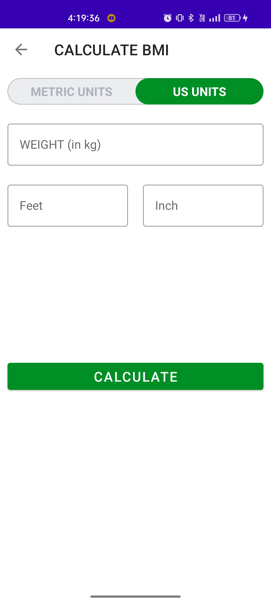

# 7-Min-WorkOutApp

This is an Android application designed to help users track their workout routine and maintain a healthy lifestyle. The app has several features such as calculating BMI and tracking the history of exercise by storing the time and date.

  

  
  
  
  
  
  

## Features

* **Workout Tracker**: Users can create and track their workout routine by adding exercises, sets, and reps. They can also view their progress and set goals to achieve their fitness targets.

* **BMI Calculator**: The app has a built-in BMI calculator that allows users to calculate their Body Mass Index and determine if they are in a healthy weight range.

* **Exercise History**: The app keeps a record of all the exercises done by the user along with the time and date. Users can view their exercise history to track their progress and make necessary adjustments to their workout routine.

## Getting Started

To use the app, download and install it on your Android device. Once installed, open the app and create an account. You can then start tracking your workout routine and using the other features of the app.

## Usage

### Workout Tracker

1. Open the app and navigate to the workout tracker section.
2. Click on the "Add Exercise" button to add an exercise to your routine.
3. Enter the details of the exercise such as exercise name, sets, and reps.
4. Click on the "Save" button to save the exercise to your routine.

### BMI Calculator

1. Open the app and navigate to the BMI calculator section.
2. Enter your height and weight in the provided fields.
3. Click on the "Calculate BMI" button to calculate your Body Mass Index.
4. The app will display your BMI along with the corresponding weight category.

### Exercise History

1. Open the app and navigate to the exercise history section.
2. The app will display a list of all the exercises done by the user along with the time and date.
3. Users can view their exercise history to track their progress and make necessary adjustments to their workout routine.

## Technologies Used

* Java
* Android SDK
* Android Room Database

